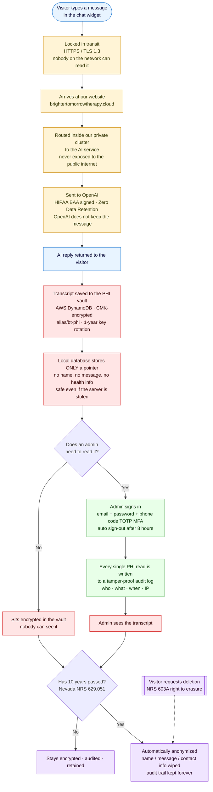
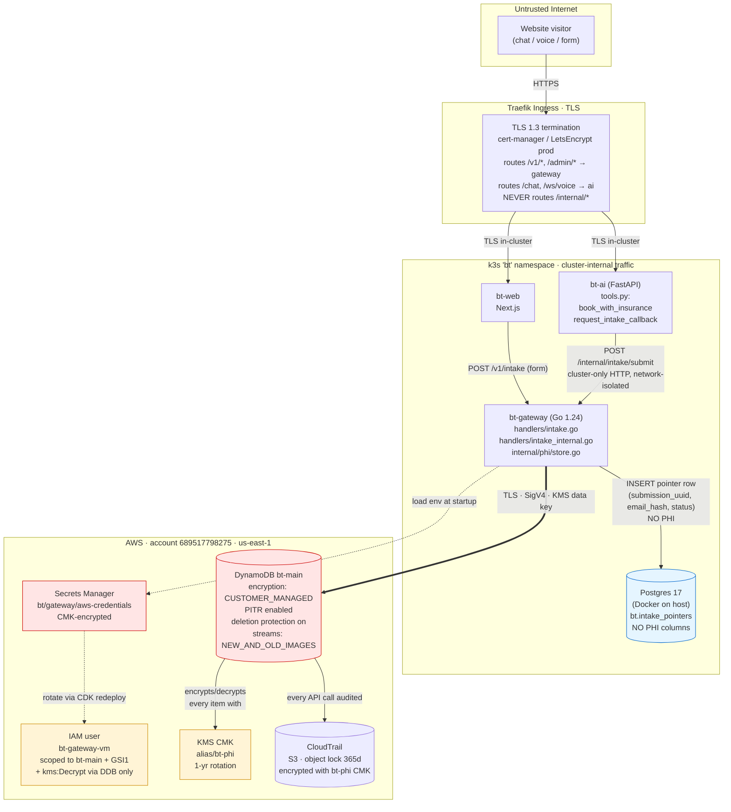
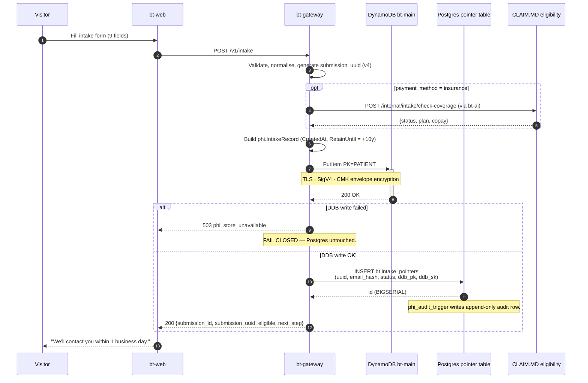
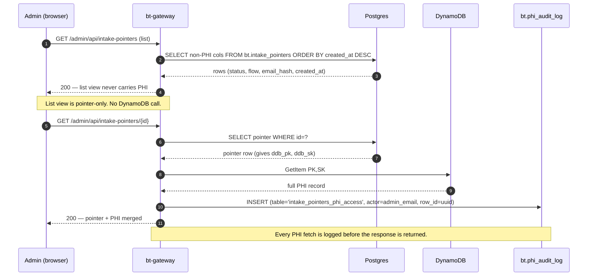
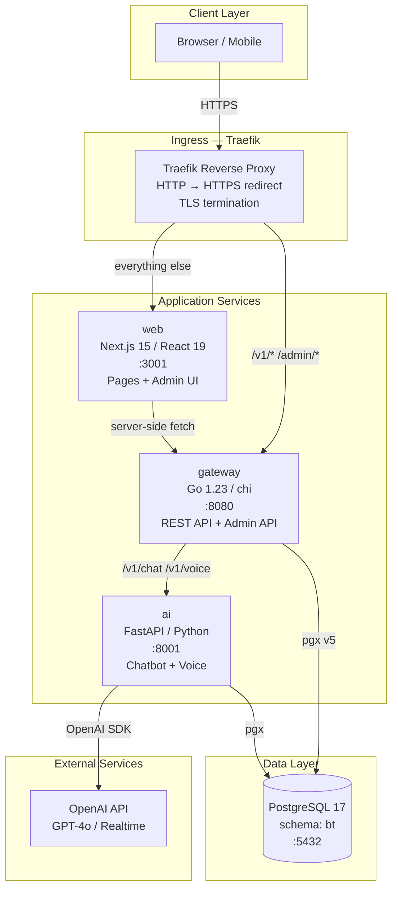
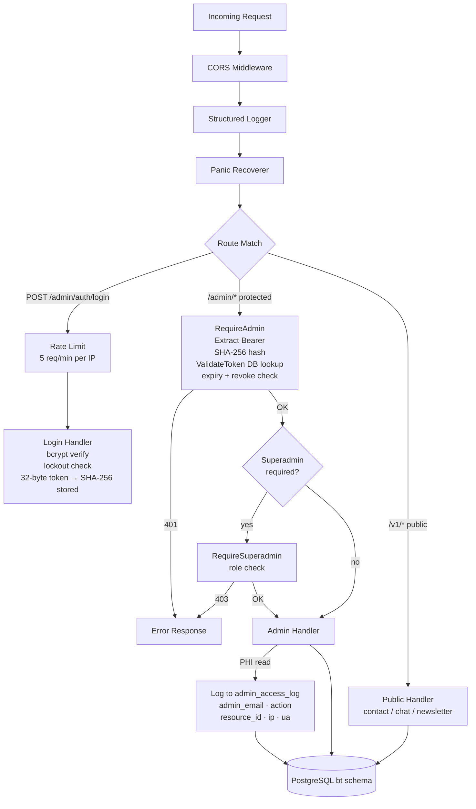
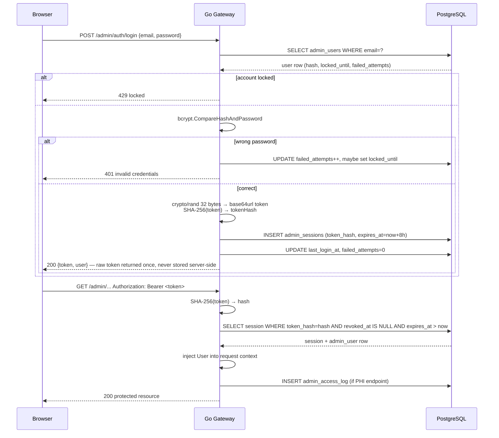
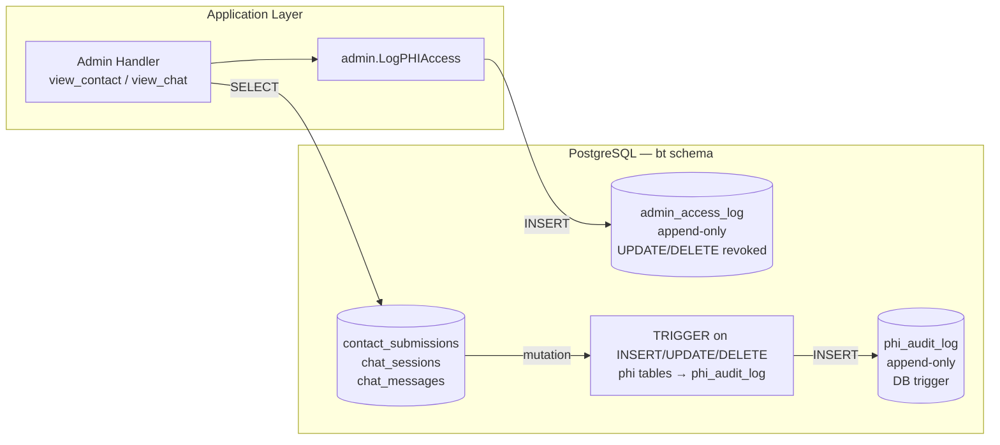
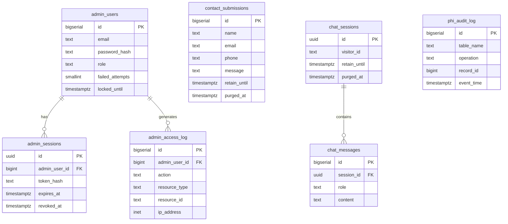

# Brighter Tomorrow Therapy

Full-stack rebuild of brightertomorrowtherapy.com — Las Vegas therapy practice.

## Services

| Service | Tech | Port |
| ------- | ---- | ---- |
| **web** | Next.js 15, React 19, Tailwind, Framer Motion | 3001 (dev) |
| **gateway** | Go 1.24, chi (HTTP router + middleware), pgx v5, AWS SDK v2 (DynamoDB) — REST API + admin API | 8080 |
| **ai** | FastAPI, OpenAI Agents SDK 0.17 (`gpt-realtime-2`) — multi-agent text + voice triage graph | 8001 |
| **db** | PostgreSQL 17, schema `bt` — non-PHI metadata, FAQ embeddings, admin sessions | 5432 |
| **PHI store** | DynamoDB `bt-main` (us-east-1), CMK `alias/bt-phi`, PITR enabled | AWS |

All traffic routes through Traefik: `/v1/*` and `/admin/*` → gateway, everything else → web.

### Go gateway internals

**chi** is the HTTP router — it matches URL patterns (`/admin/contacts/{id}`), chains middleware (auth, rate-limiting, logging), and extracts path params. It has nothing to do with concurrency; it is purely a routing library.

**Goroutines** are used for concurrency in two places:

1. `cmd/gateway/main.go` — the HTTP server runs in a goroutine so the main goroutine can block on OS signals (`SIGINT`/`SIGTERM`) and trigger a graceful shutdown:
   ```go
   go func() {
       srv.ListenAndServe()  // blocks in its own goroutine
   }()
   signal.Notify(quit, syscall.SIGINT, syscall.SIGTERM)
   <-quit  // main goroutine waits here
   srv.Shutdown(ctx)
   ```

2. `internal/handlers/chat.go` — after the AI service responds, the assistant reply is persisted using a **background context** (detached from the request context) so a client disconnect after the AI call cannot leave the chat history in a torn state (user message recorded, assistant reply missing):
   ```go
   persistCtx, cancel := context.WithTimeout(context.Background(), 5*time.Second)
   defer cancel()
   pool.Exec(persistCtx, "INSERT INTO bt.chat_messages ...", sessionID, reply)
   ```
   `net/http` itself also spawns one goroutine per incoming request automatically.

**chi and goroutines are not alternatives** — chi routes requests, goroutines provide concurrency. Both are in use.

### AI service internals

The AI service runs **two parallel agent graphs** sharing the same specialist agents and tools:

| Path | Entry | SDK primitive | Use |
| ---- | ----- | ------------- | --- |
| **Text** (`POST /chat`) | `bt_agents/triage_agent.py` | `Agent` + `handoff(...)` | Browser chat widget |
| **Voice** (`WS /ws/voice`) | `bt_agents/realtime/triage.py` | `RealtimeAgent` + `realtime_handoff(...)` | Mic-button voice mode |

Both flow Triage → one of `{Crisis Support, Info, Therapist Matching, Intake, Booking}`. Each specialist lives in its own file under `ai/app/bt_agents/` (text) and `ai/app/bt_agents/realtime/` (voice). The head Triage agent owns all handoffs; specialists never reach across to peers.

The voice path is driven entirely by `openai-agents` `RealtimeRunner` / `RealtimeSession` — the SDK manages the OpenAI WebSocket, hand-off lifecycle, and tool-calling. `voice.py` only translates browser ↔ session events (audio in/out, user/assistant transcripts, hallucination filtering) and persists transcripts to Postgres.

Realtime model is `gpt-realtime-2` with `gpt-4o-mini-transcribe` for input transcription, semantic-VAD turn detection, and PCM16 audio. Override via secret keys `REALTIME_MODEL`, `REALTIME_TRANSCRIPTION_MODEL`, `REALTIME_VOICE` in `bt-config`.

## Local dev

The cluster runs in k3d (`bt` cluster), and **Tilt is managed as a systemd user service** (`tilt-bt.service`) that hot-syncs source edits into the running pods. You should not need to run `tilt up` or `kubectl cp` manually.

```bash
# Service status / logs
systemctl --user status tilt-bt
journalctl --user -u tilt-bt -f

# Pause / resume the watcher (e.g. to run interactive `tilt up` for the UI on :10350)
systemctl --user stop tilt-bt
systemctl --user start tilt-bt
```

What edits go live where:

| Edit | What happens | Restart needed |
| ---- | ------------ | -------------- |
| `web/src/**` | Tilt syncs → Next.js HMR | No |
| `ai/app/**` | Tilt syncs → `uvicorn --reload` | No |
| `gateway/**` | Tilt rebuilds image + rolls pod | Automatic |
| `requirements.txt`, `package.json`, `go.mod` | Full image rebuild + roll | Automatic |
| `Tiltfile`, `k8s/*.yaml` | Tilt re-applies | Automatic |

First-time install of the dev loop on a fresh box:

```bash
# Install service unit
cp ops/systemd/tilt-bt.service ~/.config/systemd/user/   # or write the unit by hand
sudo loginctl enable-linger ubuntu                       # auto-start at boot
systemctl --user daemon-reload
systemctl --user enable --now tilt-bt
```

Run a service standalone (not via systemd) only if you have a specific reason:

```bash
cd web && npm install && npm run dev          # http://localhost:3001
cd gateway && go run ./cmd/gateway            # needs DATABASE_URL
cd ai && pip install -r requirements.txt && uvicorn app.main:app --port 8001
```

## Admin Dashboard

**URL:** `/admin/login`

A HIPAA-compliant admin dashboard for managing all site data and monitoring compliance.

### Features

| Section | What you can do |
| ------- | --------------- |
| **Dashboard** | Live stats — contacts, chat sessions, newsletter, content counts, purge queue alert |
| **Contacts** | Paginated list (no message body in list view); click row for full record |
| **Chat Sessions** | Browse all AI chat sessions; view full message transcripts |
| **Newsletter** | Manage subscribers; unsubscribe or flag for NRS 603A deletion |
| **PHI Audit Log** | Append-only log of every INSERT/UPDATE/DELETE on PHI tables |
| **Admin Access Log** | Every admin read of PHI is recorded here |
| **Purge Queue** | Records past their 10-year retention window; trigger anonymization |
| **Content** | Edit FAQs, blog posts, site settings, team, services, testimonials, locations, nav, stats |

### First-time setup

On first gateway startup, set these k8s secrets and the first superadmin is created automatically:

```bash
kubectl -n bt patch secret bt-config --type=json -p='[
  {"op":"add","path":"/data/ADMIN_INITIAL_EMAIL","value":"'$(echo -n admin@example.com | base64)'"},
  {"op":"add","path":"/data/ADMIN_INITIAL_PASSWORD","value":"'$(echo -n yourpassword | base64)'"}
]'
kubectl -n bt rollout restart deployment/bt-gateway
```

## HIPAA Compliance (45 CFR Part 164)

This codebase implements HIPAA Technical Safeguards for a therapy practice handling Protected Health Information (PHI). Nevada state law (NRS 629.051, NRS 603A) adds additional requirements.

### Chatbot data — plain-English end-to-end

What happens to a single message the moment a visitor types it into the chat widget, in language anyone can read.



**One-line summary of each safeguard layer:**

| Step | The plain-English promise | The HIPAA control |
|---|---|---|
| In transit | "Nobody between the visitor and us can read it." | §164.312(e) Transmission Security — TLS 1.3, HSTS, cert-manager |
| Inside our cluster | "Internal services can't be reached from the internet." | Traefik ingress never exposes `/internal/*` |
| At OpenAI | "OpenAI is a HIPAA business associate and throws the message away." | BAA + Zero Data Retention on the OpenAI account |
| At rest | "Encrypted with a key only we control." | §164.312(a)(2)(iv) — AWS KMS customer-managed key |
| Local DB | "The server in our datacenter never sees the PHI." | Minimum Necessary (§164.502(b)) — pointer-only schema |
| Admin login | "Password alone isn't enough — phone code required." | §164.312(d) — TOTP MFA via Cognito |
| Admin reads | "Every peek is recorded and can't be erased." | §164.312(b) — append-only `admin_access_log` |
| Retention | "Erased automatically once we no longer need it." | Nevada NRS 629.051 — 10-year auto-purge |
| Erasure request | "Visitors can ask us to delete their record." | Nevada NRS 603A — anonymisation procedures |


### What counts as PHI here

- **`contact_submissions`** — name, email, phone, message (contains health context)
- **`chat_sessions` / `chat_messages`** — AI chatbot transcripts (potential health disclosure)
- **`newsletter_subscribers`** — email linked to therapy inquiry

### Safeguards implemented

#### §164.312(a)(1) — Access Control
- Every admin user has a unique account (`bt.admin_users`)
- Role-based access: `superadmin` (full access) and `auditor` (read-only on audit logs)
- Shared credentials are prohibited by design

#### §164.312(a)(2)(iii) — Automatic Logoff
- Admin sessions have a hard 8-hour TTL (`expires_at = created_at + 8h`)
- Sessions are revoked on explicit logout; expired sessions are rejected at every request

#### §164.312(b) — Audit Controls
Three append-only audit tables:
- **`bt.phi_audit_log`** — database-level trigger captures every INSERT/UPDATE/DELETE on PHI tables (content/message fields redacted)
- **`bt.admin_access_log`** — application-level log; every admin read of PHI (contact detail, chat transcript, audit log) is recorded with timestamp, admin email, IP address, and resource ID
- Both tables have `UPDATE`, `DELETE`, `TRUNCATE` revoked from all roles

#### §164.312(c) — Integrity
- Passwords: bcrypt, cost 12
- Session tokens: 32-byte `crypto/rand` → base64url; only the SHA-256 hash is stored in DB
- The raw token is never logged

#### §164.312(d) — Authentication
- Account lockout: 5 failed login attempts → 30-minute lock
- Login endpoint rate-limited to 5 requests/minute per IP
- Timing-safe comparison on unknown email (runs bcrypt regardless to prevent user enumeration)

#### §164.312(e) — Transmission Security
- All traffic HTTPS only (Traefik redirects HTTP → HTTPS)
- `HttpOnly`, `Secure`, `SameSite=Strict` on visitor tracking cookie

#### §164.502(b) — Minimum Necessary
- Contact list endpoint omits `message` body — only returned on the detail endpoint (which is PHI-logged)
- IP address and user-agent removed from `contact_submissions` (no documented clinical need)

### Nevada state law

#### NRS 629.051 — 10-year medical records retention
- `retain_until` column set automatically on INSERT to `created_at + 10 years`
- `bt.phi_due_for_purge` view surfaces records past their retention date
- Admin purge queue page lists these records; anonymization is one click (logged)

#### NRS 603A — Security of Personal Information / Right to Erasure
- `bt.anonymise_contact(id)` — redacts name, email, phone, message; sets `purged_at`
- `bt.anonymise_chat_session(uuid)` — redacts all message content; nulls `visitor_id`
- Newsletter: `deletion_requested_at` flag for erasure workflow

### Database roles

| Role | Can do |
| ---- | ------ |
| `app` | All DML on content + PHI tables; INSERT on audit logs; SELECT on `phi_audit_log` (admin dashboard) |
| `bt_readonly` | SELECT on all tables in `bt` schema |
| `bt_auditor` | SELECT on `phi_audit_log`, `admin_access_log`, `admin_users`, `admin_sessions` |

### Migrations

| File | Purpose |
| ---- | ------- |
| `db/schema.sql` | Base schema — all content and PHI tables |
| `db/migrations/001_perf_indexes.sql` | Query performance indexes |
| `db/migrations/002_hipaa_compliance.sql` | Audit triggers, retention columns, anonymization procedures, DB roles |
| `db/migrations/003_admin.sql` | Admin users, sessions, access log tables |

## Intake PHI Storage — DynamoDB-backed (HIPAA)

Identifying patient information collected through the chat widget, voice agent, or website intake forms (`first_name`, `last_name`, `date_of_birth`, `phone`, `email`, `home_address`, `sex`, `insurance_name`, `insurance_member_id`) is **never persisted to local Postgres**. PHI lives in a CMK-encrypted DynamoDB table (`bt-main`) on AWS; Postgres holds only a non-PHI pointer row that admin lists query.

### Why this split

The Postgres instance runs in a Docker container on the application VM (Hostinger). That container is fine for non-PHI workflow data — admin sessions, FAQ vectors, contact-form metadata — but it is **not** a HIPAA-eligible PHI store: no AWS BAA, no customer-managed key, no PITR, no cross-AZ replication. The right place for PHI is AWS DynamoDB with the existing `alias/bt-phi` customer-managed key.

### Data flow with security boundaries



### Security controls at every layer

| Layer | Control | Protects against |
|---|---|---|
| **Transit · visitor → ingress** | TLS 1.3, HSTS, LE-prod cert via cert-manager | Eavesdropping on the public internet |
| **Transit · gateway → DynamoDB** | TLS to `dynamodb.us-east-1.amazonaws.com`, SigV4 request signing | Man-in-the-middle, request tampering, replay |
| **Transit · ai → gateway** | Cluster-internal only; `/internal/*` is not in the Traefik ingress at all | External callers reaching internal endpoints |
| **AuthN · gateway → DynamoDB** | IAM user `bt-gateway-vm` with static access key (rotated via CDK redeploy) | Unauthorised AWS API access |
| **AuthZ · IAM policy scope** | Only `PutItem/GetItem/Query/UpdateItem/DescribeTable` on `bt-main` + GSI1; `kms:Decrypt` only `ViaService = dynamodb.*.amazonaws.com` | Lateral movement to other AWS resources if the key leaks |
| **At rest · DynamoDB** | `TableEncryption.CUSTOMER_MANAGED` with `alias/bt-phi` (KMS, 1-yr rotation) | AWS insider access, disk-image exfiltration |
| **At rest · Secrets Manager** | Same `alias/bt-phi` CMK encrypts the gateway access key secret | Secret leakage from CloudFormation history |
| **At rest · Postgres pointer table** | No PHI columns. Stores only `submission_uuid`, `sha256(email)`, `status`, `created_at`, `retain_until` | Nothing identifying to leak even if the VM is compromised |
| **Audit · DynamoDB** | CloudTrail (data events on bt-main → S3 with object lock 365 d) | Tampering with the audit trail |
| **Audit · Postgres** | `phi_audit_trigger` on `bt.intake_pointers` writes every INSERT/UPDATE/DELETE to `bt.phi_audit_log` (append-only) | Silent admin actions |
| **Audit · admin PHI access** | `GetIntakePointer` writes to `bt.phi_audit_log` with admin email + row id every time PHI is fetched from DynamoDB on detail view | §164.312(b) "audit controls" |
| **Retention** | 10-year `retain_until` set on insert (Nevada NRS 629.051); weekly CronJob purges expired rows from both stores | Over-retention liability |
| **Right to erasure** | `bt.mark_intake_pointer_purged(id)` + DynamoDB `DeleteItem` | NRS 603A erasure request |
| **Fail-closed** | `/v1/intake` returns 503 if DynamoDB write fails; pointer row is **never** written without DynamoDB success first | Silently downgrading PHI to local Postgres if AWS is unreachable |
| **Reachability** | `/readyz` pings `DescribeTable` on `bt-main`; pod is removed from k8s service rotation if AWS is unreachable | Sending traffic to a pod that can't store PHI |

### Intake submission lifecycle



### Admin PHI access lifecycle



## Architecture Diagrams

### High Level Design (HLD)



### Low Level Design (LLD)

#### Go Gateway — Middleware Stack & Request Lifecycle



#### Admin Auth Sequence



#### PHI Audit Trail Flow



#### Database ER Diagram (key tables)



To apply all migrations:

```bash
PGPASSWORD=<pass> psql -h localhost -U app -d app -f db/schema.sql
PGPASSWORD=<pass> psql -h localhost -U app -d app -f db/migrations/001_perf_indexes.sql
PGPASSWORD=<pass> psql -h localhost -U app -d app -f db/migrations/002_hipaa_compliance.sql
PGPASSWORD=<pass> psql -h localhost -U app -d app -f db/migrations/003_admin.sql
```

## DB schema

All tables in `bt` schema:

**Content**
- `site_settings` (singleton) — brand, colors, hours, social
- `nav_items` — header/footer navigation with parent_id for dropdowns
- `services`, `specialties` — therapy offerings
- `team_groups`, `team_members` — staff directory
- `testimonials`, `faqs`, `stats`, `blog_posts`
- `locations`, `press_mentions`, `podcast`, `free_resources`

**PHI**
- `contact_submissions` — contact form intake (retain_until, purged_at)
- `chat_sessions` / `chat_messages` — AI chatbot transcripts (retain_until, purged_at)
- `newsletter_subscribers` — email list (unsubscribed_at, deletion_requested_at)

**Compliance**
- `phi_audit_log` — database-level PHI mutation log (append-only)
- `admin_users` / `admin_sessions` — admin authentication
- `admin_access_log` — admin PHI read log (append-only)
- `phi_due_for_purge` — view: records past NRS 629.051 retention window
