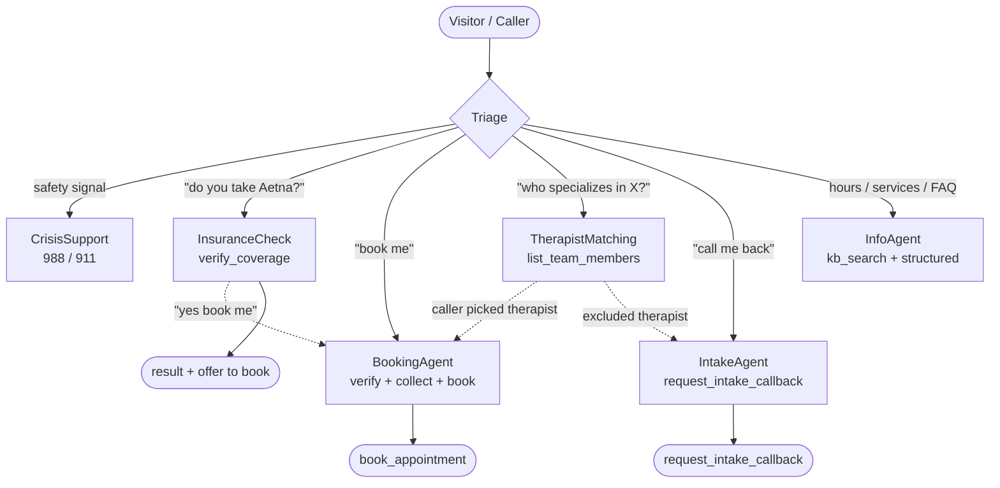
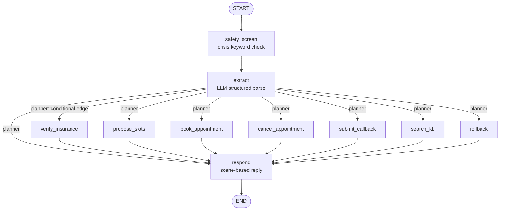
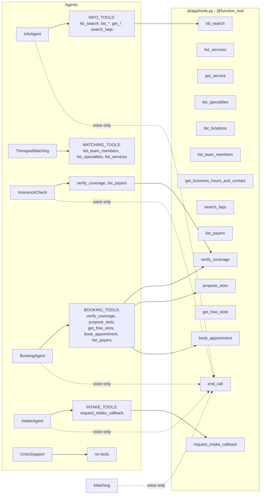
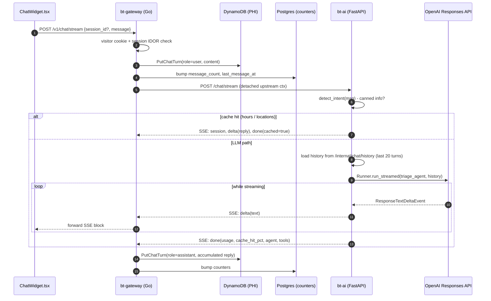
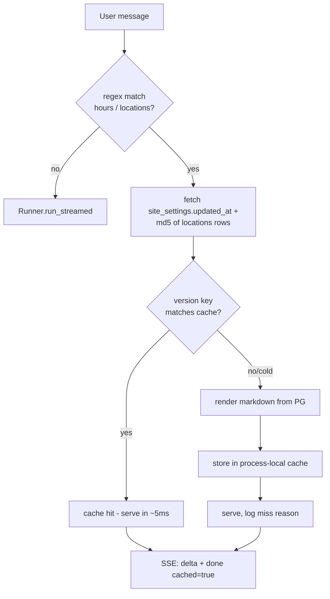
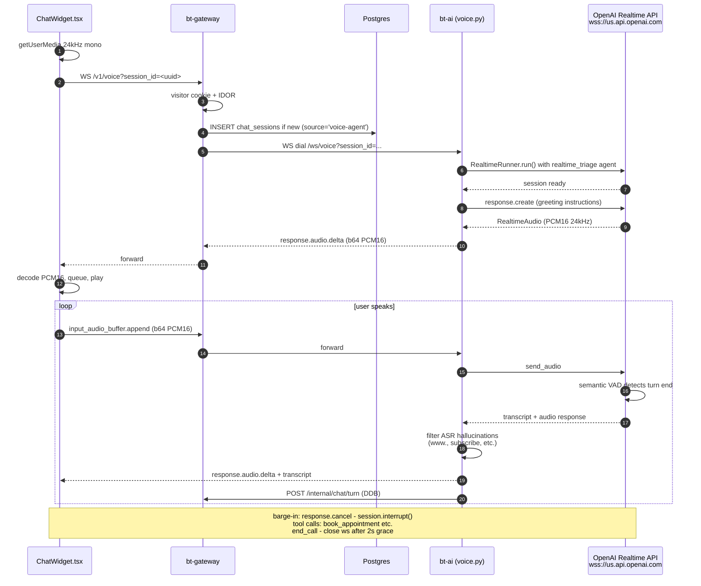
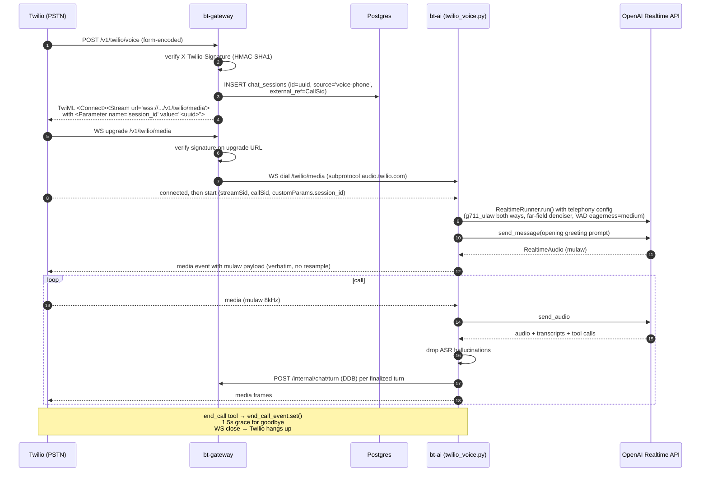
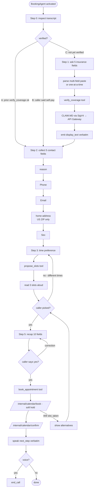
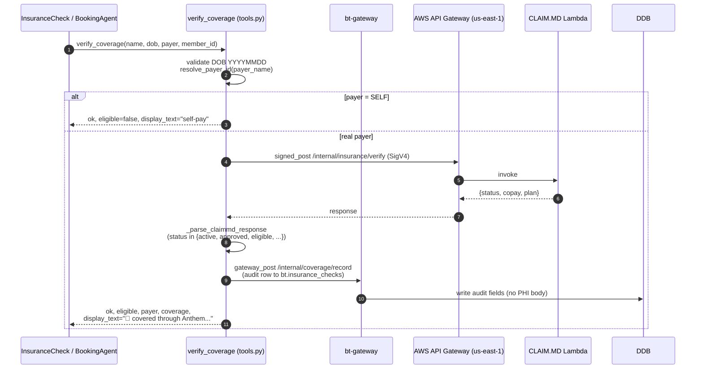
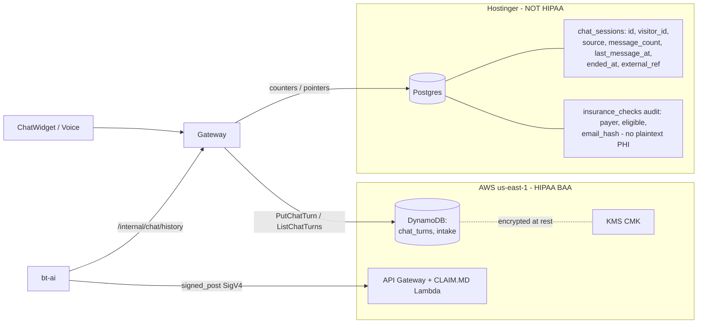

# Brighter Tomorrow Therapy — Voice & Chat Agents

How the AI assistant for **brightertomorrowtherapy.cloud** actually works, end to end.

There is **one agent graph**, with **two surfaces**:

| Surface | Transport | Audio? | Where the prompt lives |
|---|---|---|---|
| **Text chat** (widget) | `POST /v1/chat/stream` (SSE) | no | `ai/app/bt_agents/*.py` |
| **Browser voice** (mic in widget) | `WS /v1/voice` (PCM16, 24 kHz) | yes | `ai/app/bt_agents/realtime/*.py` |
| **Twilio phone** (PSTN) | `WS /v1/twilio/media` (μ-law, 8 kHz) | yes | `ai/app/bt_agents/realtime/*.py` |

Both surfaces share the same **tools** (`ai/app/tools.py`), the same **roster** (`ai/app/bt_agents/roster.py`), and the same **payer list** (`ai/app/data/payers.py`). They **diverge** only in: (1) prompts (text vs. voice persona), (2) audio formats, (3) the `end_call` tool that the voice agents have but the chat agent doesn't.

---

## 1. The agent graph (identical shape on text + voice)



- **Triage owns no tools.** Its only job is to route via exactly one handoff. It never collects info and never replies in its own voice (except to disambiguate a bare "hi"). See `ai/app/bt_agents/triage_agent.py:33` and `ai/app/bt_agents/realtime/triage.py:22`.
- **BookingAgent and InsuranceCheck are independent.** BookingAgent runs `verify_coverage` itself if Triage routed straight to it; InsuranceCheck runs `verify_coverage` and offers to hand off to BookingAgent. Whoever runs the verification, the result lives in conversation memory and the other agent reads it from there. (`ai/app/bt_agents/booking_agent.py:48-75`, `ai/app/bt_agents/insurance_agent.py:110-150`.)
- **Crisis routing is a guardrail + a route.** A keyword guardrail (`bt_agents/guardrails.py`) flags safety language for telemetry but does **not** trip the wire — Triage routes naturally so the caller gets a warm reply, not a 500.

---

## 1b. LangGraph topology (`ai/app/graph/`)

The control-flow underneath the agents is a compiled LangGraph `StateGraph`. One cycle per user turn: safety screen → extract → planner (conditional edge) → one action node → respond → END. Checkpointer saves state; the next turn resumes from END.



**Nodes** (`ai/app/graph/nodes/`):

| Node | Role | Writes |
|---|---|---|
| `safety_screen` | deterministic crisis keyword sweep | `safety_signal` |
| `extract` | LLM structured-output parse of the last user turn | `intent`, `affirmation`, `field_deltas` into `insurance_fields` / `booking_fields` / `callback_fields` |
| `planner` | pure router (conditional edge, not a real node) — see `planner.py` | nothing |
| `verify_insurance` / `propose_slots` / `book_appointment` / `cancel_appointment` / `submit_callback` / `search_kb` | action nodes — call one tool from `ai/app/tools.py` | their tool result + `last_action` |
| `rollback` | undo a pending confirmation when caller says "no" | clears the pending state |
| `respond` | LLM scene-based patient reply | appends to `messages`, sets `last_reply_text` |

**State** (`ai/app/graph/state.py:State` — one TypedDict, total=False):

- **Identity:** `channel`, `session_id`, `caller_phone`, `agent_source`
- **Per-turn ephemeral** (overwritten by `extract`): `affirmation`, `safety_signal`, `last_user_text`
- **Sticky:** `intent`, `payment_path`, `booking_status`, `callback_status`
- **Collected fields:** `insurance_fields` (5), `booking_fields` (5), `callback_fields` (4), `staff_id`, `staff_name`
- **Tool results:** `verify_result`, `proposed_slots`, `selected_slot`, `appointment_id`, `callback_id`, `kb_snippets`
- **Plumbing:** `messages` (with `add_messages` reducer), `last_action`, `pending_question`, `last_reply_text`, `soft_safety_asked`

**Edges** (`ai/app/graph/graph.py`):

- `START → safety_screen → extract`
- `extract --conditional(planner)--> {respond, verify_insurance, propose_slots, book_appointment, cancel_appointment, submit_callback, search_kb, rollback}`
- every action node `→ respond`
- `respond → END`

Planner priority is documented inline in `ai/app/graph/nodes/planner.py:1` — crisis > low-confidence > pending-confirm yes/no > cancel > out-of-scope > info > callback > insurance/booking.

---

## 2. Tool surface (one source: `ai/app/tools.py`)



`VOICE_TOOLS = [end_call]` is appended to every realtime agent's tool list (`ai/app/tools.py:398`). Text agents do not get `end_call` — it would be meaningless over SSE.

---

## 3. Text chat — request lifecycle



**Key files / line refs**

- Widget streams via `fetch("/v1/chat/stream")` and parses SSE manually — `web/src/components/ChatWidget.tsx:159-256`.
- Gateway forwards SSE with a **detached** `context.WithTimeout(5min)` so a tab-close doesn't cancel the upstream and lose the assistant turn — `gateway/internal/handlers/chat_stream.go:130`.
- AI service builds the agent, hits the canned-reply cache first, then calls `Runner.run_streamed` — `ai/app/main.py:248-402`.
- Conversation history lives in **DynamoDB**, *not* Postgres, because Hostinger is not HIPAA. The AI loads it via `GET /internal/chat/history` — `ai/app/main.py:113-137`, `gateway/internal/handlers/chat_internal.go:85-117`.
- Prompt-cache key `bt-chat-v1` pins the OpenAI cache prefix across requests — `ai/app/main.py:64`.

---

## 4. Canned-reply fast path (info_cache)



`ai/app/info_cache.py` — process-local, version-keyed against the source rows, so admin edits invalidate automatically. Misses pay one render cost; no LLM is called.

---

## 5. Browser voice (mic in widget) — WebRTC-style streaming over WebSocket



Files:
- Browser audio capture + WS protocol: `web/src/components/ChatWidget.tsx:283-444`.
- Gateway WS proxy (with session IDOR + chat-first→voice-agent source promotion): `gateway/internal/handlers/voice.go`.
- AI bridge (RealtimeRunner, hallucination filter, DDB persistence): `ai/app/voice.py:216-475`.
- Realtime config (PCM16, semantic VAD low eagerness, marin voice): `ai/app/bt_agents/realtime/config.py:48-69`.

---

## 6. Twilio phone — PSTN → realtime agent graph



Files:
- Gateway TwiML + WS proxy with Twilio HMAC-SHA1 signature check: `gateway/internal/handlers/twilio.go:64-258`.
- AI Twilio bridge (mulaw passthrough, DTMF forwarding, end_call hangup event): `ai/app/twilio_voice.py:252-602`.
- Telephony realtime config (mulaw, far-field, VAD medium): `ai/app/bt_agents/realtime/config.py:77-102`.
- The `end_call` tool sets a `contextvars.ContextVar[asyncio.Event]` that the bridge waits on — `ai/app/tools.py:1107-1139` + `ai/app/twilio_voice.py:67-70,540-566`.

---

## 7. Booking flow inside the BookingAgent



The booking prompt (`ai/app/bt_agents/booking_agent.py:48-276`) is the longest and most rule-heavy in the system. The voice variant (`ai/app/bt_agents/realtime/booking.py`) has identical steps plus the `VOICE_CONFIRMATION_RULE` (digit-by-digit / letter-by-letter readback) from `prompts.py:84-120` to defend against ASR errors.

---

## 8. Insurance verification — `verify_coverage`



`display_text` is **composed server-side** so the LLM cannot accidentally skip telling the caller the result. The agent prompt makes this contract explicit ("emit `display_text` VERBATIM as your visible reply"). See `ai/app/tools.py:691-839` and `ai/app/bt_agents/insurance_agent.py:110-150`.

---

## 9. PHI / HIPAA boundary

Hostinger Postgres is **not** under a BAA. Every PHI byte flows through AWS DynamoDB instead.



- Message bodies, transcripts, intake details: **DynamoDB only**.
- Postgres holds non-PHI pointers — counters, source label, ended_at flag, hashed email for joining.
- The gateway `/internal/*` namespace has **no public ingress route**; cluster network isolation IS the auth boundary (`gateway/internal/handlers/chat_internal.go:14-19`).

---

## 10. Models, voices, and where they're configured

| Knob | Default | Override env |
|---|---|---|
| Chat model | (SDK default Responses model) | `OPENAI_MODEL` |
| Embedding model | `text-embedding-3-small` | `OPENAI_EMBED_MODEL` |
| Realtime model | `gpt-realtime-2` | `REALTIME_MODEL` |
| Realtime transcription | `gpt-4o-mini-transcribe` | `REALTIME_TRANSCRIPTION_MODEL` |
| Realtime voice | `marin` | `REALTIME_VOICE` |
| Realtime base URL | `wss://us.api.openai.com/v1/realtime` (US-pinned) | `REALTIME_BASE_URL` |
| Prompt cache key | `bt-chat-v1` | `BT_PROMPT_CACHE_KEY` |
| Browser-voice max session | 600 s | hard-coded `_MAX_SESSION_SECONDS` |
| Twilio max call | 900 s | `TWILIO_MAX_CALL_SECONDS` |

Defined in `ai/app/main.py:64`, `ai/app/bt_agents/realtime/config.py:13-28`, `ai/app/voice.py:41`, `ai/app/twilio_voice.py:58`.

---

## 11. Source map

```
ai/app/
├── main.py                        FastAPI: /chat, /chat/stream (SSE), /ws/voice, /twilio/voice, /twilio/media
├── voice.py                       Browser-mic ↔ OpenAI Realtime bridge (PCM16)
├── twilio_voice.py                Twilio Media Streams ↔ OpenAI Realtime bridge (μ-law)
├── agent.py                       Returns build_triage_agent()
├── tools.py                       All @function_tools + INFO/MATCHING/INTAKE/BOOKING/VOICE groups
├── prompts.py                     Shared prompt constants: PRACTICE_CONTEXT, STYLE_TEXT, STYLE_VOICE,
│                                  CRISIS_RULE, ANTI_DEFLECTION_RULE, VOICE_CONFIRMATION_RULE
├── info_cache.py                  Canned-reply cache (hours / locations) — version-keyed
├── aws_signer.py                  SigV4 signed_post / signed_get → API Gateway; gateway_post → bt-gateway
├── db.py                          Postgres pool (read-only kb / faqs / services / specialties / locations)
├── embed_faqs.py                  /internal/embed-faqs — re-embed after admin FAQ edits
├── log_stream.py + logging_config Live log SSE for /admin/* dashboard
└── bt_agents/
    ├── triage_agent.py            Text Triage — handoff-only, no tools
    ├── booking_agent.py           Text booking — full flow + verify_coverage + propose_slots + book_appointment
    ├── insurance_agent.py         Text insurance check — verify_coverage + handoff to booking
    ├── intake_agent.py            Text callback — request_intake_callback only
    ├── matching_agent.py          Text therapist matching — list_team_members, hands off to booking/intake
    ├── info_agent.py              Text practice info — kb_search + structured tools
    ├── crisis_agent.py            Text crisis — no tools, 988/911
    ├── guardrails.py              Crisis-keyword input guardrail (telemetry only, never trips)
    ├── roster.py                  Single source of truth: 6 bookable + 4 callback-only therapists
    └── realtime/
        ├── __init__.py            Re-exports build_realtime_triage + run/model configs
        ├── config.py              gpt-realtime-2, marin voice, PCM16 vs g711_ulaw, semantic VAD, US-pinned URL
        ├── triage.py              Voice Triage — same routing rules, voice persona, handoffs
        ├── booking.py             Voice booking — same 7 steps + read-back/confirmation rule
        ├── insurance.py           Voice insurance check
        ├── intake.py              Voice callback
        ├── matching.py            Voice therapist matching
        ├── info.py                Voice practice info
        └── crisis.py              Voice crisis

web/src/components/
└── ChatWidget.tsx                 SSE chat client + WS voice client + insurance dropdown picker

gateway/internal/handlers/
├── chat.go                        POST /v1/chat (non-stream)
├── chat_stream.go                 POST /v1/chat/stream (SSE proxy with detached upstream ctx)
├── chat_end.go                    POST /v1/chat/end (sendBeacon on tab close)
├── chat_internal.go               /internal/chat/{turn,history,end} — bt-ai's PHI-safe DDB API
├── voice.go                       WS /v1/voice — visitor IDOR + WS proxy to bt-ai
└── twilio.go                      POST /v1/twilio/voice (TwiML) + WS /v1/twilio/media (HMAC-SHA1 + WS proxy)
```

---

## 12. Things that look weird but are intentional

- **Two parallel agent trees** (`bt_agents/` and `bt_agents/realtime/`). The OpenAI Agents SDK uses different base classes (`Agent` vs `RealtimeAgent`) and different handoff helpers (`handoff` vs `realtime_handoff`). The voice tree is not a thin wrapper — it has its own prompts (voice persona, read-back rule) and gets `end_call`. Memory `feedback_sync_all_agents`: any prompt or tool change must be applied to **both** trees.
- **`display_text` composed server-side** in `verify_coverage`. The model used to occasionally call `transfer_to_bookingagent` without first emitting the result, leaving the caller staring at silence. Pre-rendering the message and forcing the prompt to echo it verbatim fixed it. See `ai/app/tools.py:806-838`.
- **DOB is echoed once in plain English, never as MM/DD vs DD/MM**. Memory `feedback_dob_confirm`: prior phrasing confused callers. Now: "Got it — August 19, 1998, correct?" Period.
- **ASR hallucination filter**. Whisper / `gpt-4o-mini-transcribe` emit "subscribe to our channel", "thanks for watching" on silence/non-English audio. We drop those before they hit the agent and `session.interrupt()` any response they triggered — `voice.py:74-105`, `twilio_voice.py:102-133`.
- **Greeting via `response.create` raw event, not a fake user turn**. Earlier code injected a fake "user" message which polluted the transcript. Now the SDK history starts clean and the model's first assistant turn IS the greeting — `voice.py:295-309`.
- **Detached context when proxying SSE.** A tab-close mid-reply must not cancel the upstream OpenAI call — we still need the full assistant turn for the DDB audit trail (`chat_stream.go:130`).
- **`agent_source` ContextVar** stamps every intake/coverage submission with `chat-agent` / `voice-agent` / `voice-phone`, so admin reports can split modalities (`tools.py:25`).
