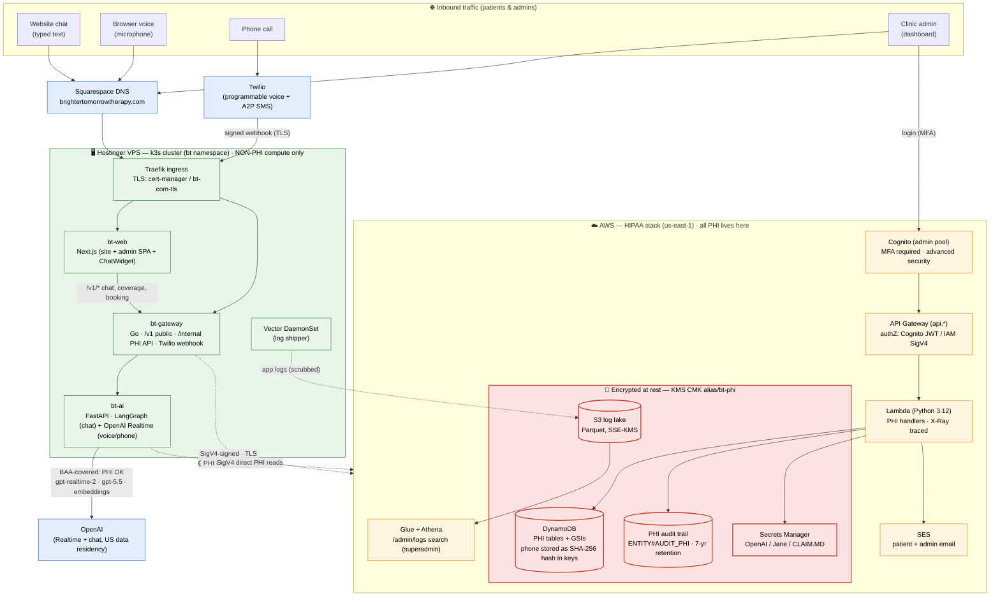

# Brighter Tomorrow Therapy — Voice & Chat Agents

The AI assistant behind **brightertomorrowtherapy.com**, serving three surfaces with HIPAA-safe persistence on AWS:

- **Text chat** runs on a **LangGraph** agent (one compiled `StateGraph`).
- **Browser voice** and **Twilio phone** run on the **OpenAI Realtime** speech-to-speech stack (`gpt-realtime-2`) — a self-contained realtime multi-agent pipeline that does **not** go through LangGraph.

The two stacks are independent. They share business logic only through the same tool implementations (`integrations/voice_tools.py`), gateway PHI endpoints, and persona/scope constants — never through the graph.

This README has two halves:

- **Sections A–C** are written for a non-technical reader (clinic staff, ops, anyone who wants to understand what the bot does without reading code). They use simple flowcharts.
- **Sections 1–10** are written for an engineer who needs to be productive in a day.

---

## A. What the bot actually does (plain English)

A patient lands on the website (or dials the clinic's phone number). The bot:

1. Greets them and gets HIPAA consent.
2. Figures out whether they want **info**, an **appointment**, a **callback**, an **insurance check**, or are in **crisis**.
3. Collects the few facts it needs (name, DOB, insurance, reason, etc.).
4. Either books the appointment, files a callback, gives info — or hands off to a human.
5. Records everything safely so a clinician or admin can pick up where the bot left off.

The patient gets the same persona, scope, and safety rules on every surface — but there are **two** runtimes under the hood. Typed chat runs on the LangGraph agent; spoken conversations (browser mic or phone) run on the OpenAI Realtime speech-to-speech stack.

```
   Website chat            Browser voice          Phone call
   (typed text)             (microphone)           (Twilio)
        │                        │                     │
        ▼                        └──────────┬──────────┘
  ┌─────────────┐                           ▼
  │  LangGraph  │              ┌──────────────────────────────┐
  │   agent     │              │  OpenAI Realtime stack        │
  │ (graph/)    │              │  (gpt-realtime-2, speech-to-  │
  └─────────────┘              │   speech; bt_agents/realtime, │
                               │   voice.py / voice_hc /       │
                               │   voice_rt / twilio_voice.py) │
                               └──────────────────────────────┘
        └──────── shared tools, PHI endpoints, persona ────────┘
```

## B. The patient journey, step by step

This is what happens in each conversation. Boxes are decisions the bot makes; the bot never skips a safety/consent box.

```
   ┌──────────────────────────────────────────────────────┐
   │ Patient says or types something                      │
   └──────────────────────┬───────────────────────────────┘
                          │
                          ▼
   ┌──────────────────────────────────────────────────────┐
   │ 1. Safety screen                                     │
   │    Anything like "hurt myself" / suicide / abuse?    │
   │    → YES → send crisis script + alert admin          │
   └──────────────────────┬───────────────────────────────┘
                          │ NO
                          ▼
   ┌──────────────────────────────────────────────────────┐
   │ 2. Understand what they said (extract)               │
   │    What did they want? Did they answer yes/no?       │
   │    Any name / DOB / insurance / phone in the text?   │
   └──────────────────────┬───────────────────────────────┘
                          │
                          ▼
   ┌──────────────────────────────────────────────────────┐
   │ 3. Gates (these must pass, in order)                 │
   │    a. HIPAA disclosure heard? (voice only — chat     │
   │       shows a notice under the widget)               │
   │    b. Caller physically in Nevada?                   │
   │       NO  → polite "we only see NV patients" + close │
   │    c. Caller asking about themselves (not someone    │
   │       else's adult chart without an ROI)?            │
   │       NO  → "we need a signed release first" + close │
   │    d. Returning patient? Confirm DOB; then offer     │
   │       "continue where you left off?" if applicable.  │
   └──────────────────────┬───────────────────────────────┘
                          │ all gates pass
                          ▼
   ┌──────────────────────────────────────────────────────┐
   │ 4. Pick a path                                       │
   │                                                      │
   │   info        → search FAQ / KB, then answer         │
   │   insurance   → ask 5 fields, verify with CLAIM.MD   │
   │   booking     → ask insurance + booking fields,      │
   │                 then offer slots and confirm         │
   │   callback    → ask 4 fields, then file a request   │
   │   cancel      → confirm and cancel                   │
   │   out of scope→ politely say "I can't help with that"│
   └──────────────────────┬───────────────────────────────┘
                          │
                          ▼
   ┌──────────────────────────────────────────────────────┐
   │ 5. Reply (respond)                                   │
   │    Speak/type back to the patient. End of turn.      │
   └──────────────────────────────────────────────────────┘
```

After every reply, the bot saves the conversation. The next message picks up exactly where the bot left off — even if the patient hangs up and calls back, or refreshes the browser.

## C. Where a real human gets involved (handoffs)

The bot is allowed to do five things on its own: answer info, verify coverage, propose slots, book, cancel. **Anything else turns into a handoff** — the bot puts an item in the admin queue and a human at the clinic picks it up:

| Handoff | Triggered when… |
|---|---|
| `crisis` | Safety screen fires (self-harm, abuse, urgent danger). |
| `out_of_state` | Caller confirms they're not in Nevada. |
| `roi_required` | Third party asking about another adult's care with no signed release. |
| `mandatory_report` | Caller discloses something that triggers Nevada's mandatory-report rules. |
| `admin_verification` | Insurance check came back ambiguous and needs a person to look at it. |
| `admin_with_note` | Workers' comp / EAP / anything that needs a note attached. |
| `admin_callback` | Catch-all — the bot is stuck or the patient asked for a human. |

Each handoff writes a row into the `bt-admin-queue` (or `bt-safety-queue` for crisis) DynamoDB table. Both tables are encrypted with the `bt-phi` KMS key and kept for 90 days.

```
   bot decides handoff
            │
            ▼
   write row → bt-admin-queue / bt-safety-queue
            │
            ▼
   notifications retry Lambda fans out:
       • SMS to clinic phone
       • email to clinic inbox
       • PHI log object → S3 (bt-phi-logs)
            │
            ▼
   admin dashboard shows the row, clinician calls back
```

---

The rest of the document is the engineer-facing reference.

## 1. High-level architecture

Three services run in the `bt` namespace of a k3d cluster behind a single Traefik ingress:

| Service | Lang | Role |
|---|---|---|
| `bt-web` | Next.js (App Router) | Marketing site + admin dashboard + ChatWidget |
| `bt-gateway` | Go (chi) | Public ingress for `/v1/*`, Twilio webhook, internal `/internal/*` PHI API, admin endpoints |
| `bt-ai` | Python (FastAPI) | LangGraph agent (text chat) + OpenAI Realtime voice/phone stack + canned-reply cache |

PHI never lives on Hostinger Postgres. Anything regulated (transcripts, intake details, eligibility responses, graph checkpoints, pending booking requests, admin/safety queue rows) is read from or written to AWS DynamoDB / Lambda via `bt-gateway` (SigV4-signed by `bt-ai` for direct PHI reads).

**Text chat** is one compiled LangGraph `StateGraph`; every typed turn runs one cycle through that graph (section 2). **Browser voice and phone** are a separate OpenAI Realtime speech-to-speech stack (section 2a) — the model handles turn-taking, transcription, and TTS natively, and calls the same tool implementations the graph's action nodes use. The two runtimes never call into each other.

### Infrastructure & HIPAA boundary (traffic → services → AWS)

The diagram below shows how traffic enters, which compute serves it, and how the **HIPAA boundary** is drawn: the Hostinger VPS holds **no PHI**, and every regulated read/write crosses into AWS, where it lands in **CMK-encrypted** stores (KMS `alias/bt-phi`) behind authenticated, audited endpoints. OpenAI is covered by a signed BAA, so PHI may be sent to it.



**Why this is HIPAA-compliant by construction:**

- **No PHI on Hostinger.** The k3s compute layer is stateless for regulated data — transcripts, intake, eligibility, checkpoints, and queues are only ever read/written across the boundary into AWS.
- **Encryption at rest (§164.312(a)(2)(iv)).** Every PHI store (DynamoDB, S3 log lake, Secrets Manager) uses the customer-managed KMS key `alias/bt-phi` with rotation enabled; TLS in transit everywhere.
- **Minimum necessary in keys.** DDB GSI keys carry only a SHA-256 hash of the phone number; raw identifiers live in the encrypted item body, never in an index key.
- **Access control & audit (§164.312(b),(d)).** Admin access is Cognito-gated with MFA; API Gateway authorizes via Cognito JWT or IAM SigV4; every PHI mutation writes a 7-year-retention audit row, and admin log queries are themselves audited.
- **BAAs in place.** OpenAI (signed BAA, US data residency) and AWS — the only two processors that touch PHI.

---

## 2. The text-chat agent runtime (LangGraph)

This section is the **text-chat** runtime. Everything in `ai/app/graph/`. There is one graph, one set of prompts, and one source of truth for state. (Browser voice and phone do **not** use this — see section 2a.)

### Graph topology

One cycle per user turn. The graph has three structural pieces:

```
                START
                  │
                  ▼
            safety_screen          ← deterministic keyword sweep
                  │
                  ▼
              extract              ← single structured-output LLM call
                  │                    (the ONLY natural-language boundary)
                  ▼
              planner ──────────── conditional edge ────┐
                                                        │
   ┌────────────────────────────────────────────────────┘
   │
   ├──► GATES                gate_resume_offer (the other 4 gates are
   │                          inline checks inside the planner)
   │
   ├──► HANDOFFS (terminal)  handoff_crisis
   │                          handoff_out_of_state
   │                          handoff_roi_required
   │                          handoff_mandatory_report
   │                          handoff_admin_with_note
   │                          handoff_admin_verification
   │                          handoff_admin_callback
   │
   ├──► ACTIONS              verify_insurance ──► (2nd conditional edge
   │                          propose_slots          back to planner)
   │                          book_appointment       │
   │                          cancel_appointment     ├──► offer_self_pay
   │                          submit_callback        ├──► capture_self_pay_consent
   │                          search_kb              ├──► send_coverage_result
   │                          rollback               └──► handoff_admin_*
   │
   └──► BOOKING CHAIN        book_appointment ─► create_pending_request
                                              ─► send_acknowledgement
                                              ─► log_phi

        record_sms_consent       ← post-booking A2P SMS opt-in (chat only;
                                     voice captures it via a Realtime tool)
                  │
                  ▼
              respond                ← scene-based LLM reply
                  │
                  ▼
                 END
```

Why two conditional edges into the planner? After `verify_insurance` runs, the planner reads `last_node == "verify_insurance"` and re-routes based on `insurance_fields.outcome` (eligible / ineligible / self-pay / wc_eap / manual_review / no_insurance / secondary). The planner is one function; both call-sites share it.

Anti-loop guarantees: gate flags are monotonic, the planner enforces a hard `_MAX_TURNS = 60` ceiling that escalates to `handoff_admin_callback`, and terminal handoffs set `gates.terminal = True` so subsequent turns short-circuit straight to `respond` without re-firing admin alerts.

### Where the agent's behavior is defined

- `graph/graph.py` — wires nodes and edges; `get_app()` returns the compiled, checkpointed runnable (module-level singleton).
- `graph/state.py` — the `State` TypedDict, the field-completeness helpers, and `initial_state(...)`. Read this before adding state.
- `graph/nodes/`:
  - `safety_screen.py` — deterministic crisis-keyword sweep.
  - `extract.py` — single structured-output LLM call.
  - `planner.py` — pure-Python router. Defines `N.*` (every node name as a symbol).
  - `respond.py` — scene-based reply.
  - `rollback.py` — clears a pending confirmation on "no".
  - `actions/` — `insurance.py`, `booking.py`, `coverage.py`, `notify.py`, `sms_consent.py` (post-booking A2P opt-in capture), plus `_legacy.py` for `propose_slots / book_appointment / cancel_appointment / submit_callback / search_kb / check_payer`.
  - `gates/` — `disclosure.py`, `nv_presence.py`, `caller_relationship.py`, `returning_verify.py`, `resume_offer.py`. Only `resume_offer` is wired as a graph node; the other four are inline checks the planner makes against state flags set by `extract`.
  - `handoffs/` — seven terminal nodes. The shared `_post_admin_notification` helper lives in `handoffs/__init__.py`.
- `graph/prompts/`:
  - `persona.py` composes the per-turn system prompt for the channel + scene.
  - `scenes.py` holds `SCENE_INSTRUCTIONS` and `FIELD_PROMPTS`.
  - `extract.py` holds the extraction system prompt and the `TurnExtraction` Pydantic schema.
  - `_constants.py` holds the persona / scope / safety / voice-pacing constants reused across surfaces.
- `graph/runtime/chat.py` — the chat transport adapter: maps `POST /chat` and `/chat/stream` onto one graph cycle and emits the SSE wire format. (`graph/runtime/legacy_cascaded/` holds the **retired** Deepgram→LangGraph→Cartesia voice pipeline — kept for reference, not wired into prod.)
- `graph/checkpointer.py` — `DynamoDBSaver` (table `bt-langgraph-checkpoints`, KMS-encrypted, TTL 24 h) with a `MemorySaver` fallback if AWS creds are missing.
- `graph/tracing.py` — LangSmith project hookup.
- `graph/config.py` — env-driven model selection and checkpointer selection.
- `graph/evals/` — eval datasets and runners.

---

## 2a. The voice & phone runtime (OpenAI Realtime)

Browser voice and Twilio phone do **not** run the LangGraph. They run a self-contained OpenAI **Realtime** speech-to-speech stack — `gpt-realtime-2` does turn-taking (server VAD), transcription, and TTS natively, and calls tools directly. There is no `extract`/`planner`/`respond` cycle and no DynamoDB checkpointer; conversation state lives in the open Realtime session for the duration of the call.

**Where it lives (all outside `graph/`):**

- `bt_agents/realtime/` — the realtime multi-agent definitions (`triage.py`, `config.py`) — the agents/handoffs the Realtime session runs.
- `prompts.py` — the realtime persona/scope/safety prompts (kept in sync with the graph's `_constants.py` by hand).
- `integrations/voice_tools.py` — the tool implementations the realtime agents call (`book_with_insurance`, `verify_insurance`, `request_intake_callback`, `record_sms_consent`, …). These are the **same business actions** the graph's `actions/` nodes perform, hitting the same gateway PHI endpoints.
- `voice.py` — `run_voice_session(ws, session_id)`, the browser-mic entrypoint behind `/ws/voice`.
- Phone bridge, selected at runtime by the **`VOICE_BRIDGE`** env var on `/twilio/media`:

| `VOICE_BRIDGE` | Module | Notes |
|---|---|---|
| `hc` | `voice_hc/bridge.py` | **Current prod** — port of the healthcare_prior_auth bridge (VAD 0.75, `gpt-4o-mini-transcribe`). |
| `raw_ws` | `voice_rt/twilio_bridge.py` | Raw OpenAI Realtime WS, explicit turn-taking (server_vad threshold 0.85). Rollback target. |
| `sdk` | `twilio_voice.py` | OpenAI Agents SDK bridge (default if the var is unset). |

Twilio frames are μ-law 8 kHz ↔ PCM16 24 kHz. The bridge is pre-warmed at pod startup (`main.py`) because importing the realtime stack cold costs ~4.5 s, which would otherwise hit the first caller after every restart.

> Edit voice behavior in this stack only — **never** in `graph/` for a voice change. Conversely, prompt/tool changes that should affect both surfaces must be propagated to both `graph/` and the realtime stack by hand (grep before marking done).

### Models

| Knob | Default | Override env |
|---|---|---|
| Chat / extract / respond model | `gpt-4o-mini` (code default); prod pin `gpt-5.5-2026-04-23` | `OPENAI_MODEL` (and optional `OPENAI_EXTRACT_MODEL` / `OPENAI_RESPOND_MODEL`) |
| Realtime / voice model | `gpt-realtime-2` | `REALTIME_MODEL` |
| Realtime voice | `marin` | `REALTIME_VOICE` |
| Realtime base URL | `wss://us.api.openai.com/v1/realtime` (US-pinned) | `REALTIME_BASE_URL` |
| Checkpointer | DDB when `AWS_ACCESS_KEY_ID` is set, else memory | `BT_LANGGRAPH_CHECKPOINT=ddb|memory` |

Production values live in the `bt-config` Kubernetes secret (`k8s/10-secrets.yaml`, gitignored).

---

## 3. Directory map

```
ai/                 Python FastAPI service (the agent)
  app/
    main.py            FastAPI entrypoint — endpoints in section 7
    core/              cross-cutting infra (db pool, logging, log SSE)
    integrations/      outbound clients
      aws_signer.py      SigV4 signed_post / signed_get / gateway_post
      tools.py           reused helpers (_fetch_free_slots, _validate_dob, ...)
      voice_tools.py     tool impls the Realtime voice/phone agents call
    ingestion/         one-shot data loads (run as k8s Jobs)
    caching/           process-local canned-reply cache (hours/locations)
    data/              static reference data (payers, roster)

    # --- TEXT CHAT: LangGraph runtime (section 2) ---
    graph/             LangGraph runtime
      graph.py, state.py, checkpointer.py, tracing.py, config.py, api.py
      nodes/
        safety_screen.py, extract.py, planner.py, respond.py, rollback.py
        actions/         insurance, booking, coverage, notify,
                         sms_consent, _legacy
        gates/           disclosure, nv_presence, caller_relationship,
                         returning_verify, resume_offer
        handoffs/        crisis, out_of_state, roi_required,
                         mandatory_report, admin_with_note,
                         admin_verification, admin_callback
      prompts/           persona, scenes, extract, _constants
      runtime/           chat (the live SSE chat adapter)
        legacy_cascaded/ retired Deepgram→graph→Cartesia voice (not in prod)
      evals/             eval datasets + runners
      tests/             pytest smoke + regression tests

    # --- VOICE & PHONE: OpenAI Realtime stack (section 2a) ---
    bt_agents/realtime/  realtime multi-agent defs (triage.py, config.py)
    prompts.py           realtime persona/scope/safety prompts
    voice.py             run_voice_session — browser-mic entrypoint (/ws/voice)
    voice_hc/            prod phone bridge (VOICE_BRIDGE=hc)
    voice_rt/            raw-WS phone bridge (VOICE_BRIDGE=raw_ws)
    twilio_voice.py      Agents-SDK phone bridge (VOICE_BRIDGE=sdk)

gateway/            Go service (chi router)
  cmd/gateway/main.go    routes + wiring
  internal/
    config/                env config
    phi/                   PHI-handling helpers (DDB / KMS)
      store.go              chat turns, intake
      insurance.go          insurance audit rows
      callbacks.go          callback intake
      admin_queue.go        bt-admin-queue / bt-safety-queue writes
      sms_consent.go        A2P SMS opt-in records (CONSENT#SMS#<phoneHash>)
      returning_lookup.go   returning-patient lookup by DOB
      intake_list.go, audit.go
    handlers/
      chat.go, chat_stream.go, chat_end.go      /v1/chat[/stream|/end]
      chat_internal.go                          /internal/chat/{turn,history,end}
      voice.go                                  WS /v1/voice (proxy to bt-ai)
      twilio.go                                 /v1/twilio/voice + /v1/twilio/media
      intake.go, intake_internal.go             intake submissions
      coverage.go, coverage_check.go            eligibility (SigV4 to AWS)
      sms_consent_internal.go                   /internal/sms/consent (chat/voice opt-in)
      internal_calendar.go                      Jane calendar bridge
      callback.go, contact.go, newsletter.go    public form endpoints
      faqs.go, match.go, health.go
      returning_lookup.go                       /internal/phi/returning_patient_lookup
      session_turns.go                          /internal/phi/session_turns
      admin_handoff.go                          /internal/admin/handoff_queue
      admin_safety.go                           /internal/admin/safety_queue
      admin_*.go                                admin dashboard endpoints

web/                Next.js (App Router)
  src/
    app/             routes: /, /about, /team, /services, /specialties,
                     /rates, /contact, /admin/*, /faqs, /blog, /our-approach,
                     /sms-terms (A2P opt-in terms), ...
    components/
      ChatWidget.tsx  SSE chat + WS voice + insurance dropdown + session persistence
      ...             Hero, Booking, CoverageModal, MatchModal, etc.
    lib/             Cognito client, fetch helpers
    middleware.ts    admin auth

db/                 Hostinger Postgres (non-PHI)
  schema.sql, 02_kb.sql, seed.sql
  migrations/        additive migrations applied at deploy time

infra/              AWS CDK (TypeScript)
  lib/               api-, auth-, data-, gateway-iam-, observability-,
                     secrets-, security-, notifications-retry-, hostinger-dns
  lambdas/           verify_insurance, handle_chat, get_patient_data,
                     get_dashboard_metrics, list_chat_sessions,
                     jane_ical_sync, hostinger_dns_cr, notifications_retry,
                     common_layer

k8s/                Manifests for the k3d cluster (namespace `bt`)
  00-namespace.yaml         bt namespace
  06-cert-manager-issuer.yaml  Let's Encrypt prod ClusterIssuer (bt-tls)
  10-secrets.yaml           bt-config (gitignored)
  20-ai.yaml, 25-gateway.yaml, 30-web.yaml   Deployments + Services
  40-ingress.yaml           Traefik ingress + middlewares
  50/51/52-*-ingest-job.yaml KB / team / FAQ ingest Jobs
  70-phi-cleanup-cronjob.yaml, 71-chat-idle-cronjob.yaml

ops/                build-and-deploy.md, runbooks, systemd units
scripts/            twilio_provision.sh + DDB migration scripts
```

---

## 4. Request flow

### Chat (text)

1. Widget calls `POST /v1/chat/stream` on the gateway with `{ session_id, message }`.
2. Gateway checks the visitor cookie + IDOR guard (session belongs to this visitor), then forks two writes: a DDB `PutChatTurn` for the user message and a non-PHI counter bump in Postgres.
3. Gateway proxies the request to `bt-ai` (`POST /chat/stream`) with a **detached** context so a tab-close mid-stream does not cancel the upstream run — we still need the full reply for the DDB audit trail.
4. `bt-ai` first checks the canned-reply cache (`caching/info_cache.py`) for "what are your hours / locations" — sub-10 ms response, no LLM.
5. On a miss, `bt-ai` runs one cycle of the LangGraph for the thread (`graph.aget_state` → resume or seed `initial_state`) and emits the SSE wire format: `session` → one `delta` → `done`.
6. Gateway streams the SSE back to the widget and, on `done`, writes the assistant turn to DDB.

### Browser voice

1. `getUserMedia` (24 kHz mono) in the widget → WebSocket to `GW /v1/voice?session_id=...`.
2. Gateway IDOR-checks, ensures a `chat_sessions` row exists with `source='voice-agent'`, and proxies the WS to `bt-ai /ws/voice`.
3. `bt-ai` accepts the WS and delegates to `voice.py:run_voice_session` — the OpenAI **Realtime** speech-to-speech stack (`gpt-realtime-2`). This is **not** the LangGraph.
4. The Realtime session handles VAD turn-taking, transcription, and TTS natively; audio streams bidirectionally between the caller and OpenAI (US-pinned `wss://us.api.openai.com/v1/realtime`).
5. Tool calls (book, verify, callback, SMS consent) are the realtime agents calling `integrations/voice_tools.py`, which hit the same gateway PHI endpoints the graph's action nodes use; turns persist to DDB via the gateway with `agent_source='voice-agent'`.

### Twilio phone

1. PSTN call hits Twilio → `POST /v1/twilio/voice` on the gateway.
2. Gateway verifies `X-Twilio-Signature` (HMAC-SHA1 of URL + sorted form params), mints a UUID session, inserts a non-PHI `chat_sessions` row with `source='voice-phone'` and `external_ref=CallSid`, then returns TwiML: `<Connect><Stream url="wss://.../v1/twilio/media"><Parameter session_id|call_sid|caller_phone />`.
3. Twilio opens the Media Stream WS. Gateway re-verifies the signature on the upgrade URL, upgrades with `Sec-WebSocket-Protocol: audio.twilio.com`, and proxies bytes verbatim to `bt-ai`.
4. `bt-ai /twilio/media` hands the accepted WS to `run_twilio_session`, the OpenAI **Realtime** bridge selected by `VOICE_BRIDGE` (`hc` in prod → `voice_hc/bridge.py`; `raw_ws`/`sdk` are rollback paths). Again, **not** the LangGraph. μ-law 8 kHz frames are converted to/from PCM16 24 kHz around the Realtime session, which owns turn-taking and TTS. Tools persist via the gateway with `agent_source='voice-phone'`.

---

## 5. HIPAA boundary

Hostinger Postgres is **not** under a BAA. None of the 18 HIPAA identifiers may land there. Architecture is split accordingly.

**Hostinger Postgres (`schema bt`) — non-PHI only.**

- `chat_sessions`: `id` (uuid), `visitor_id` (cookie), `source`, `message_count`, `last_message_at`, `ended_at`, `external_ref` (e.g. CallSid). No bodies.
- `insurance_checks`: audit row per probe — payer, eligible, `email_hash`. No plaintext PHI.
- KB, FAQs, services, specialties, locations, team metadata.

**AWS (account 502263855065, region us-east-1) — HIPAA BAA.**

DynamoDB tables (every table KMS-encrypted with the `alias/bt-phi` CMK, point-in-time-recovery on, deletion protection on):

| Table | Purpose |
|---|---|
| `bt-main` | Chat turns, intake details, A2P SMS consent records (`CONSENT#SMS#<phoneHash>`), generic key-value PHI store (GSI1 for lookups). |
| `bt-langgraph-checkpoints` | Per-thread graph state, 24 h TTL. |
| `bt-jane-events` | iCal-synced Jane appointments. |
| `bt-soft-holds` | Booking soft holds before Jane confirms. |
| `bt-pending-requests` | Booking requests waiting on confirmation / clinician review. |
| `bt-notifications-outbox` | SMS / email / S3-log dispatch queue (drained by `notifications_retry` Lambda). |
| `bt-admin-queue` | Non-crisis handoffs (out-of-state, ROI, manual verification, with-note, generic admin). 90-day TTL. |
| `bt-safety-queue` | Crisis + mandatory-report handoffs. 90-day TTL. |

Lambda + API Gateway: eligibility (`/internal/insurance/verify` → CLAIM.MD), patient data lookup, dashboard metrics, Jane iCal sync, notifications retry. S3 PHI logs in `bt-phi-logs` (BAA, KMS).

**Auth + boundaries.**

- `bt-gateway` `/internal/*` namespace has **no public ingress rule** — cluster network isolation is the auth boundary. `bt-ai` calls it directly via the in-cluster service DNS.
- `bt-ai` → API Gateway is SigV4-signed with the pod's IAM credentials (`integrations/aws_signer.py`).
- `bt-gateway` and `bt-ai` both stamp every PHI write with an `agent_source` ContextVar (`chat-agent` / `voice-agent` / `voice-phone`) so admin reports can split by modality.
- Handoff and safety notifications never POST PHI: nodes write the full record to the DDB queue table under the CMK, then POST only request_id + severity + type to the gateway. The notifications-retry Lambda is the only consumer authorised to read those PHI fields back out.
- The LangGraph checkpointer writes to DDB only, KMS-encrypted, 24 h TTL — minimum necessary.
- **A2P SMS consent is PHI.** A record tying a phone number to "agreed to receive texts from a mental-health practice" is a regulated linkage, so it is written to `bt-main` (`CONSENT#SMS#<phoneHash>`, one current-state item per phone, version-stamped) under the CMK — **never** as a Postgres column, even when the web *contact* form (which itself lands in Postgres) is the surface that captures it. All four surfaces (web contact form, web booking form, chat agent, voice/phone agent) route consent through `phi.PutSMSConsent`; history lives in the immutable PHI audit log.

---

## 6. Session persistence (web widget)

`web/src/components/ChatWidget.tsx` stores the session ID in `localStorage`:

- Chat: key `bt_chat_session`, max age 24 h.
- Voice: key `bt_voice_session`, max age 30 min (voice carries more PHI density per second).
- Past the cap, the saved ID is dropped and a fresh session is minted (defends against shared-device PHI leak).
- A visible "Start fresh" button lets the visitor clear the saved session on demand.
- Visitors see a brief HIPAA notice before they start chatting.

For **chat**, the session ID is the LangGraph `thread_id`, so a refresh mid-booking resumes from the DDB checkpoint with all collected fields intact. **Voice** uses the OpenAI Realtime stack, which holds conversation state in the open session rather than a DDB checkpoint — closing the tab ends that state; the short 30-min cap on `bt_voice_session` is mainly a shared-device PHI guard.

---

## 7. Endpoints

### bt-ai (Python FastAPI, cluster-internal only)

| Method | Path | Purpose |
|---|---|---|
| GET | `/health` | Liveness check |
| POST | `/chat` | Single-shot LangGraph turn |
| POST | `/chat/stream` | SSE: `session` → one `delta` → `done` |
| WS | `/ws/voice` | Browser voice — OpenAI Realtime (PCM16 24 kHz) |
| POST | `/twilio/voice` | TwiML that opens the Media Stream |
| WS | `/twilio/media` | Twilio Media Stream → OpenAI Realtime (μ-law 8 kHz, subprotocol `audio.twilio.com`; bridge per `VOICE_BRIDGE`) |
| POST | `/internal/intake/check-coverage` | Direct eligibility check (admin) |
| POST | `/internal/embed-faqs` | Re-embed published FAQs (admin trigger) |
| GET | `/internal/cache/stats` | Canned-reply cache snapshot |
| GET | `/internal/logs/stream` | SSE feed of live log records (admin dashboard) |

### bt-gateway — public `/v1/*`

| Method | Path |
|---|---|
| GET | `/healthz`, `/readyz`, `/v1/faqs` |
| POST | `/v1/contact`, `/v1/intake`, `/v1/newsletter` |
| POST | `/v1/chat`, `/v1/chat/stream`, `/v1/chat/end` |
| GET (WS) | `/v1/voice` |
| POST | `/v1/coverage/check`, `/v1/match` |
| POST | `/v1/twilio/voice` |
| GET (WS) | `/v1/twilio/media` |

### bt-gateway — cluster-internal `/internal/*`

| Method | Path | Caller |
|---|---|---|
| POST | `/internal/intake/submit`, `/internal/callback/submit` | bt-ai |
| POST | `/internal/coverage/record` | bt-ai (audit row after CLAIM.MD probe) |
| POST | `/internal/sms/consent` | bt-ai chat/voice agents (A2P opt-in/opt-out) |
| POST | `/internal/chat/turn`, `/internal/chat/end` | bt-ai |
| GET | `/internal/chat/history` | bt-ai |
| POST | `/internal/calendar/free-slots`, `/internal/calendar/book`, `/internal/calendar/confirm` | bt-ai |
| POST | `/internal/phi/returning_patient_lookup` | bt-ai gate node |
| POST | `/internal/phi/session_turns` | bt-ai gate node (resume offer) |
| POST | `/internal/admin/handoff_queue` | bt-ai handoff nodes |
| POST | `/internal/admin/safety_queue` | bt-ai crisis / mandatory-report nodes |

`/internal/*` is not exposed through Traefik. The network boundary is the auth boundary.

---

## 8. Running locally

Local dev is k3d-only — no `docker compose` / Tilt / `next dev` shortcut. Every code edit is built into an image and rolled out. The flow lives in `ops/build-and-deploy.md`; the short version:

```bash
# 1. Build images (web needs Cognito NEXT_PUBLIC_* build args)
SHA=$(git rev-parse --short HEAD)
TAG="prod-${SHA}-$(date +%s)"
for svc in web ai gateway; do
  docker build -t "bt-${svc}:${TAG}" -t "bt-${svc}:prod" \
    -f "./${svc}/Dockerfile" "./${svc}"
done

# 2. Import into k3d
for svc in web ai gateway; do
  k3d image import --mode=direct "bt-${svc}:${TAG}" -c bt
done

# 3. Apply manifests (bump image tags in k8s/{20,25,30}-*.yaml first)
kubectl apply -f k8s/20-ai.yaml -f k8s/25-gateway.yaml -f k8s/30-web.yaml
kubectl -n bt rollout status deploy/bt-ai
```

Iteration time is in the tens of seconds. The trade-off is that you can never accidentally ship dev-mode source maps or `next dev` to production.

**Smoke tests.** `ai/app/graph/tests/` has smoke + regression tests. Run them against a built image with `pytest ai/app/graph/tests`.

**Logs.** `kubectl -n bt logs -f deploy/bt-ai` for the agent; the admin dashboard at `/admin/logs` streams the same JSON lines via the `/internal/logs/stream` SSE.

---

## 9. Deploy

Production is the same k3d cluster (`bt`) at `2.24.200.155`. TLS is cert-manager + Let's Encrypt prod (`bt-tls` secret). DNS lives at Hostinger and is managed via API (see `infra/lambdas/hostinger_dns_cr` for the custom resource).

Database migrations in `db/migrations/` are additive and applied via the bt-gateway init container at startup. KB / team / FAQ data loads run as one-shot Jobs (`k8s/50-*`, `51-*`, `52-*`).

The AWS HIPAA stack is deployed via CDK from `infra/`:

```bash
cd infra && npm install && npx cdk deploy --all
```

Account 502263855065, region us-east-1. See `infra/README.md` for stack-specific details.

---

## 10. Conventions worth knowing

- **`extract` is the only NL boundary.** Any new natural-language signal belongs as a field on `TurnExtraction` (in `graph/prompts/extract.py`), not as a regex sprinkled into a downstream node.
- **State is one big TypedDict.** Splitting it across smaller types adds plumbing without adding safety; the planner reads many fields at once.
- **Gates are monotonic.** Once a gate flag is True it must stay True — a re-raised gate is an infinite loop.
- **Handoffs are terminal.** A handoff sets `gates.terminal = True`, parks the closing scene on `state.scene`, and subsequent turns short-circuit to `respond` so admin alerts don't re-fire.
- **`display_text` is composed server-side** for tool results the LLM must read aloud verbatim (especially eligibility outcomes). This stops the model from skipping the "you're covered" message.
- **DOB is echoed once in plain English** (`"August 19, 1998, correct?"`) — never MM/DD vs DD/MM.
- **Silent handoffs.** The caller never hears "transferring you" or "let me hand you off". The handoff *is* the transfer.
- **Trust contact fields.** Booking and intake do not refuse a name, phone, email, or address on "explicit content" grounds — read it back and confirm.
- **SMS consent is captured once and never re-asked.** The `sms_consent_asked` / `sms_consent` state flags are sticky; the opt-in question is posed only after a booking and only on the chat surface (voice/phone capture it through a Realtime tool). No raw phone number is ever logged. A2P/10DLC campaign details live in `TWILIO.md`.
- **HIPAA is the default.** Every endpoint, audit row, and log line is reviewed against the boundary in section 5 before merging. PHI never lands in Postgres or stdout.
